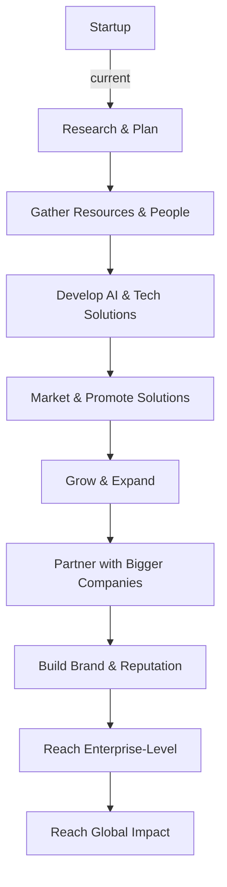

This roadmap outlines the steps necessary to take RevelTek from a small startup to an enterprise level business. Initially, RevelTek will need to create a business plan and research the industry to understand the current market and what they need to do to stand out. After that, they will need to launch a Minimum Viable Product (MVP) to start gathering customer feedback and use that to improve their product. They will then need to start expanding their team and develop AI solutions to meet customer needs. Following that, they will need to create a brand identity and network with industry professionals to build relationships. They will then need to develop strategic partnerships in order to increase their reach. This will be followed by developing marketing and advertising campaigns to build awareness of their product. After that, RevelTek will need to develop more advanced solutions to meet customer needs. Once they have a solid product, they can start to build their client base and expand their global presence. Finally, they can reach the enterprise level and become a global leader in their industry. Currently, RevelTek is on Step A, which is to develop a business plan.
